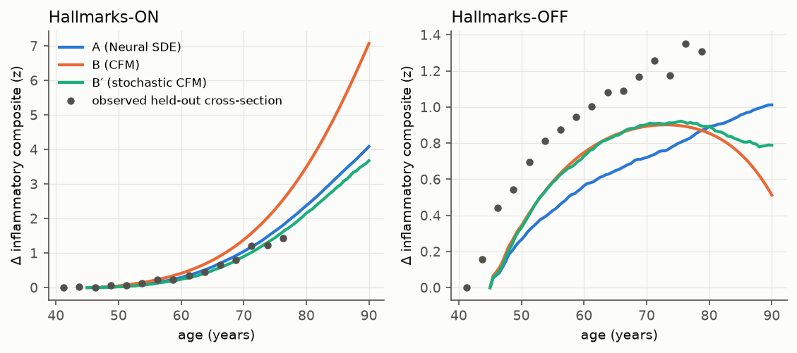
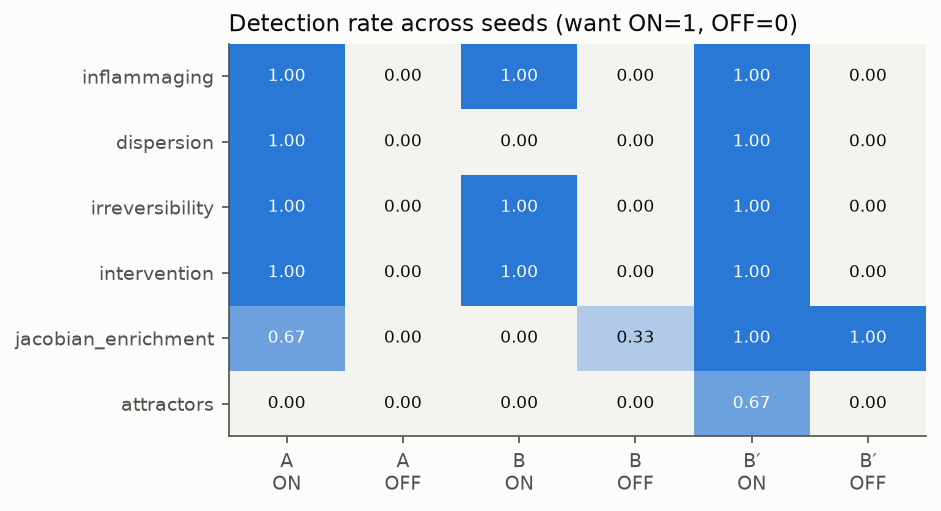
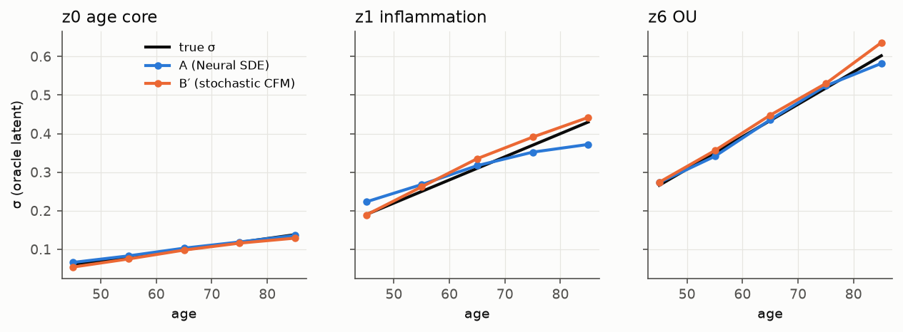
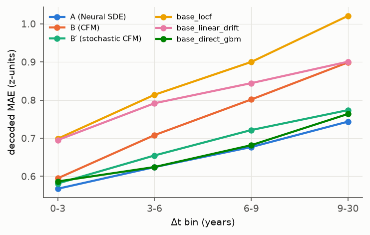

# Synthetic validation (validation ladder step 1)

*2026-10-03. Every number below comes from `runs/synthetic/{on,off}/seed{0,1,2}/results.json`.
`reports/synthetic_tables.md` holds the full auto-generated tables (mean ± sd over 3 seeds;
control models were trained for seed 0 only). Design choices and post-hoc test revisions are
listed in `reports/decisions.md`.*

## TL;DR

- **The tests work on the ground truth.** We ran every hallmark test on the *true* dynamics in the
  *true* latent:
  - all 6 model-level tests detect their planted hallmark on the hallmarks-ON cohort;
  - none fires on the hallmarks-OFF cohort.
  - Getting there required re-specifying 3 tests whose first versions failed this check; see
    "What failed" below.
- **Model A (Neural SDE) recovers the true dynamics.**
  - On the true latent, drift NRMSE is ≈ 0.1–0.17 on 6 of 8 dimensions, and diffusion is within
    ≈ 10% at every age on those 7 dimensions.
  - Through the learned encoder, recovery degrades: drift relative MSE is 0.69 (ON) and 0.28 (OFF).
    The encoder's linear decodability of the truth is only R² ≈ 0.82.
  - The intervention effect is recovered (−0.018 vs a true −0.020 latent units/yr).
- **Model B (paired CFM) does not recover the SDE drift, as theory predicts.**
  - Its velocity depends only on (z_s, a_s), so it learns the **probability-flow velocity** of the
    population, not the per-person drift.
  - It is right on monotone axes (age core NRMSE 0.12) and ≈ 0 on every mean-reverting axis
    (NRMSE ≈ 1).
  - **B′** (our score-corrected stochastic variant, f = v + ½g²∇log p) fixes this on the true
    latent: OU axes NRMSE ≈ 0.15–0.2, frailty well better than A.
  - B′ still fails on the fast rotation, because the straight-line CFM targets alias it. Through
    the encoder the score correction is noisy (drift relative MSE 0.82).
- **Forecasting (held-out people):** A > B′ > GBM ≈ (A within ~1.5%) > B > MLP > linear > LOCF on
  decoded MAE, CRPS and latent MSE. Calibration of 90% intervals: B′ 0.88, A 0.84, B 0.66.
- **Survival:** every latent model ties a Cox model on baseline features (C ≈ 0.78). No added value
  on this cohort, where hazard depends only on the current state.
- **Hallmark detection with learned models, ON vs OFF (3 seeds):**
  - **A:** 5/6 tests correct. Attractors are missed: A's Gaussian-NLL training does not learn the
    bistable frailty well.
  - **B′:** 6/6 detected on ON. The Jacobian-enrichment test also fires on OFF in 3/3 seeds, so it
    is a false positive for B′.
  - **B:** 3/6. It cannot express dispersion and its Jacobian reflects probability-flow expansion.
  - The hazard-attribution test (encoder) is detected 3/3 on ON, with 1/3 false positives on OFF.

## 1. Setup

**Cohort** (`src/mwm/data/synthetic.py`, `data/synthetic/{on,off}`): 20,000 people.
- Baseline age 40–70, 0–3 follow-ups (gaps 1–8 y). About 8,600 people have ≥ 2 visits; 33k
  visits in total.
- 33 clinical features with 1–55% per-feature missingness. A 500-gene omics block (20 pathways ×
  25 genes) is observed for 25% of people.
- Deaths are driven by the hazard: 19% died on ON, 6% on OFF.
- Ground truth is an 8-dimensional latent SDE, f = −∇V + rotation + inflammation coupling + u
  forcing, with diagonal age-dependent diffusion.

Planted hallmarks, all switched off together in the OFF cohort:

| # | Hallmark | ON | OFF (null) |
|---|---|---|---|
| a | Inflammaging | inflammation target = softplus inflection at age-core level ≈ age 65; enters hazard | linear in age core, no hazard effect |
| b | Dispersion | σ(a) ×0.4 → ×1.84 from 30 → 90 | constant σ |
| c | Irreversibility | age-core and nutrient axes have constant positive drift | both mean-revert (old people "rejuvenate") |
| d | Nutrient sensing | randomised u (30%) slows the nutrient axis by 50% | u has no effect |
| e | Pathways | genes load on their pathway's latent | loading matrix permuted (no pathway structure) |
| f | Frailty basin (added) | double well, frail well has higher hazard | single well |

**Pipeline** (`src/mwm/pipeline.py`):
1. Masked tabular transformer encoder (d = 16). It is frozen and its latents are whitened.
2. Latent observation noise is estimated by input perturbation.
3. Models trained on the same latents and splits (75/10/15 by person):
   - A, Neural SDE: native EM, 32 steps, K = 32, Gaussian NLL, errors-in-variables obs noise;
   - B: paired CFM on −∇V + g, with a Jacobian penalty;
   - B′: CFM + DSM score + fitted diffusion;
   - snapshot OT-CFM on baseline cross-sections;
   - baselines.
4. Evaluation on held-out people (first → last visit).
5. Hallmark tests on held-out states.
6. Ground-truth recovery, both through the encoder (affine map) and in an *oracle* setting where
   models are trained on the true latent.

## 2. Do the hallmark tests themselves work? (true dynamics in the true latent)

| test | ON (should detect) | OFF (should not) |
|---|---|---|
| inflammaging: acceleration ratio late/early | **7.19 → detected** | 0.09 → not |
| dispersion: tr ΣΣᵀ ratio age 80/45 | **4.43 → detected** | 1.00 → not |
| irreversibility: fraction of states with w·f ≤ 0 | **0.00 → detected** | 0.146 → not |
| intervention: metabolic share of decoded Δv (null q95 0.53) | **0.84 → detected** | no effect → not |
| Jacobian enrichment: planted aging pathways detected | **5/7** (OXPHOS, UPR, DNA repair, mTORC1, IGF1); 0 false positives | 0 pathways |
| attractors: n, deaths in high-hazard basin | **2 attractors**, death rate 0.50 vs 0.16, p ≈ 3e-22 | 1 attractor |

The SASP and inflammatory-response pathways are *not* in the leading eigen-subspace even in the
truth. The inflammation axis relaxes quickly (k = 0.4/y), so it is not a leading mode. The test
correctly reports that only the slow, monotone axes (age core, nutrient) dominate.

## 3. Ground-truth recovery

### 3.1 Oracle latent (models trained on the true z*, seed 0)

Drift NRMSE per true dimension (0 age-core, 1 infl, 2 nutr, 3–4 rotation, 5 frailty, 6–7 OU):

| model | rel. MSE ON | NRMSE ON (dims 0..7) | rel. MSE OFF | u effect (true −0.020) | Σ² old/young (true 3.50) |
|---|---|---|---|---|---|
| A | 0.51 | .11 .33 .17 .10 .09 **.92** .12 .12 | **0.014** | −0.020 | 3.65 |
| B | 0.95 | .12 .99 .25 .89 .90 1.0 1.08 1.07 | 0.86 | −0.017 | n/a |
| B′ (score-corrected) | 0.54 | .08 .36 .11 **.90 .89** .70 .15 .20 | 0.51 | −0.019 | 3.78 |
| B′ without score correction | 0.95 | .11 .99 .27 .89 .90 1.0 1.08 1.08 | 0.86 | −0.018 | 3.97 |

- A's diffusion is within 1–11% per dimension, except the frailty dimension at 51% (figure:
  `figures/diffusion_vs_age_oracle.png`).
- **Why A fails on the frailty dimension:**
  - The wells relax on a 0.3-year timescale, while visit gaps are ≥ 1 y. Only the stationary
    distribution is identifiable, not the drift curvature.
  - A Gaussian transition likelihood also cannot represent between-well jumps; it absorbs them as
    extra diffusion.
  - B′ reads the well structure from the score of the population density, which is why it does
    better there.
- **Why B fails on mean-reverting axes:** a stationary mean-reverting axis has zero
  probability-flow velocity. The score term restores it (B′ vs B′-noScore). The rotation
  (ω = 0.6 rad/y, period about 10 y, gaps 1–8 y) is aliased by straight-line CFM targets, even
  with the score correction.

### 3.2 Through the learned encoder (affine map learned → true, 3 seeds)

How well the true latent is linearly recoverable from the learned latent (R²):
- ON: 0.82 ± 0.04;
- OFF: 0.77 (the age-core axis drops to R² 0.55 because it carries little variance there).

| model | drift rel. MSE ON | OFF | u effect on z2 ON (true −0.020) |
|---|---|---|---|
| A | **0.69 ± 0.02** | **0.28 ± 0.01** | −0.018 |
| B | 0.95 | 0.83 | −0.016 |
| B′ | 0.82 ± 0.04 | 0.62 | −0.018 |
| snapshot OT-CFM | 1.02 | 0.99 | −0.002 |

- **Diffusion trace error:** A 0.36, B′ 0.13.
- **Old/young diffusion ratio (true 3.5):** A overestimates it at 10.5 ± 0.5; B′ gives
  4.4 ± 0.15. Both are flat on OFF (1.01 and 0.91).
- **Observation noise matters:** encoder error is roughly 8–25% of variance per latent dimension.
  Before we fixed the observation noise at an encoder-perturbation estimate, A and B′ absorbed it
  as large, fast mean-reverting diffusion (see `decisions.md`). This will be the dominant issue on
  real data.
- **The snapshot (cross-sectional) flow learns nothing about mean reversion or u.** u acts only
  after baseline, which cross-sections cannot see. It should only be used as an auxiliary signal.

## 4. Forecasting, survival, cost (held-out people, first → last visit; 3 seeds)

| model | latent MSE | decoded MAE | CRPS | cov50 / cov90 |
|---|---|---|---|---|
| **A** | **12.7 ± 0.6** | **0.656** | **0.482** | 0.48 / 0.84 |
| B′ | 15.7 ± 0.8 | 0.688 | 0.502 | 0.52 / 0.88 |
| B | 24.5 ± 1.2 | 0.758 | 0.585 | 0.33 / 0.66 |
| snapshot OT-CFM | 28.9 ± 7.2 | 0.780 | 0.603 | 0.32 / 0.65 |
| GBM (x0, age, Δt, u) | – | 0.665 | 0.490 | 0.43 / 0.79 |
| MLP (x0, …) / latent MLP | 16.0 (latent) | 0.776 | 0.606 | 0.31 / 0.60 |
| linear drift (LMM) | 19.7 (latent) | 0.815 | 0.600 | 0.50 / 0.86 |
| LOCF | 21.5 (latent) | 0.865 | 0.636 | 0.49 / 0.86 |

- **MAE by Δt bin** (`figures/mae_vs_dt.png`): A degrades from 0.57 to 0.74 between Δt < 3 y and
  Δt ≥ 9 y; B goes from 0.60 to 0.90. A beats GBM most clearly at the shortest (0.568 vs 0.587)
  and longest (0.744 vs 0.764) gaps, and ties it in between.
- **Hallmarks-OFF:** the same ordering holds, with A at 0.759, GBM 0.765 and B′ 0.787.
- **Survival** (Harrell's C, held-out baseline): encoder static 0.781; A 0.783; B′ 0.781; B 0.779;
  Cox on baseline features 0.782; Cox on age only 0.742. All latent models match Cox; none beats
  it.
- **Cost** (RTX 4070 Ti, ~10k training pairs):

  | model | train time | peak VRAM | NFE per 10-y rollout |
  |---|---|---|---|
  | A | 99 ± 9 s | 5.6 GB | 40 (EM) |
  | B | 3 s | 38 MB | 160 fixed RK4, or 38 with dopri5 |
  | B′ | 49 s | 5.4 GB | 40 |

  B′'s VRAM goes to the simulated diffusion stage. The velocity and score stages need under 0.1 GB.

## 5. Hallmark detection with the learned models

Detection rate over 3 seeds; controls are seed 0 only. Full table: `synthetic_tables.md`.
Heat-map: `figures/hallmark_detection.png`.

| test | A ON / OFF | B ON / OFF | B′ ON / OFF | controls (seed 0, ON) |
|---|---|---|---|---|
| inflammaging | **1.0 / 0.0** | **1.0 / 0.0** | **1.0 / 0.0** | shuffled-age A still detects (ratio 5.3, see below) |
| dispersion | **1.0 / 0.0** | – (deterministic) | **1.0 / 0.0** | constant-Σ: 0 (by construction); shuffled-age: 0 ✓ |
| irreversibility | **1.0 / 0.0** | **1.0 / 0.0** | **1.0 / 0.0** | no-potential A also detects |
| intervention (u) | **1.0 / 0.0** | **1.0 / 0.0** | **1.0 / 0.0** | – |
| Jacobian enrichment | 0.67 / 0.0 | 0.0 / 0.33 (FP) | 1.0 / **1.0 (FP)** | constant-Σ A 5/7 pathways; no-potential and shuffled-age A: none |
| attractors (frailty basin) | **0.0** / 0.0 | 0.0 / 0.0 | 0.67 / 0.0 | – |
| hazard attribution (encoder) | 1.0 / 0.33 (FP) | | | Cox control slope 0.004 < model 0.012 |

**Validation-NLL check of age-dependent vs constant Σ (A):**
- ON: age-dependent wins (4.571 vs 4.586).
- OFF: constant wins (6.703 vs 6.712).

The NLL comparison therefore points the right way on both cohorts. The margins are small, so the
pre-registered H2 rule requires the ratio test as well.

**How to read the controls:**
- **Shuffled-age null for inflammaging is weak by design here.** The planted inflection is a
  function of the *state* (the age-core level), not of calendar age, so a model trained with
  shuffled ages still learns it. This is correct behaviour. It means the "shuffled-age" null only
  tests whether a hallmark needs explicit age input.
- **Potential decomposition is not what makes irreversibility detectable.** The no-potential model
  detects it too, and A's V is not identified:
  - A: the fraction of observed held-out pairs going downhill in V is 0.50–0.56, and the V–age
    correlation ranges from −0.26 to +0.24 across seeds.
  - B/B′ (V trained by regression on the velocity): V does fall with age, with downhill fractions
    of 0.59–0.74 and correlations of −0.51 to −0.71.
  - Interpreting V on its own is therefore only defensible for B/B′ here.
- **A's Jacobian test is seed-sensitive.** It finds 5/7, 0/7 and 2/7 planted pathways across the
  three seeds, while the ground truth gives 5/7. The leading eigen-subspace of a learned
  16-dimensional field is noisy. Averaging Jacobians over seeds or ensembles is the obvious fix and
  is not yet implemented.






## 6. What failed, and why (honest list)

1. **First versions of 3 tests were invalid, and were re-specified after seeing the first run.**
   This is what the synthetic step is for; the final rules are frozen in `prereg/`.
   - *Irreversibility, first version:* "negative latent-age-probe velocity". It fails on the
     ground truth itself, because a linear age probe loads on mean-reverting axes.
   - *Intervention share, first version:* averaging |Δv| per state first diluted the effect with
     estimation noise.
   - *Attractor basin hazard, first version:* the hazard head evaluated at slice centroids
     extrapolates. The test now ranks basins by mean member hazard.
   - *Attractor slice:* it now uses the max-margin direction instead of the mean drift.
2. **Attractor test with A: 0/3.** The Gaussian-transition NLL plus visit gaps far longer than the
   well relaxation time leave A with a single broad well. B′ gets 2/3 because the score
   captures the bimodal population density.
3. **B′ Jacobian enrichment has false positives on OFF in 3/3 seeds** (IGF1 and pancreas-beta gene
   blocks).
   - With a permuted loading matrix, some gene sets correlate with a given latent direction by
     chance. B′'s leading subspace is wrong on OFF (the truth's is not), so it lands on them.
   - **Consequence:** in pre-registration, the H4 enrichment test is uninformative for B′ unless an
     OFF-style negative control passes. We will run it on a gene-label-permuted control on real
     data as well.
4. **B cannot recover mean-reverting or oscillatory dynamics** (probability-flow theory). Without a
   Jacobian penalty its long rollouts diverge: leading eigenvalues around +0.28/yr, latent MSE 92
   vs 21 for LOCF. The penalty fixes stability but not the bias.
5. **B′ through the encoder** is worse than on the oracle latent. The score of a 16-dimensional
   whitened latent is noisy and is amplified by g² in the correction. Increasing the DSM σ from
   0.2 to 0.5 helped: relative MSE went from 0.83 to 0.77 in a seed-0 diagnostic.
6. **A overestimates the age-slope of the diffusion through the encoder** (ratio 7.5 vs 4.4 in the
   test statistic). Likely causes:
   - between-well frailty jumps and residual encoder noise at older ages are absorbed as
     diffusion;
   - the observation-noise estimate is constant over age.
7. **The hazard-attribution test has 1/3 false positives on OFF** (slope 0.009, CI lower 0.004).
   On real data it needs the Cox-difference criterion, not just slope > 0.
8. **Not done:**
   - the hazard loss along the path (survival comes from integrating the frozen hazard head along
     rollouts);
   - end-to-end encoder fine-tuning;
   - Optuna hyperparameter search (fixed configs only);
   - the HetGNN encoder in the benchmark (it is unit-tested only);
   - classical gseapy prerank (wrapper provided, not used in the decision rules).

## 7. Verdict on A vs B (synthetic)

- **Model A** is the better *dynamics* model:
  - it recovers drift and diffusion on the true latent nearly exactly;
  - it has the best forecasting accuracy;
  - it passes 5/6 hallmark tests with no false positives.
- **Plain B** is fast (about 30× cheaper to train) but learns a population transport map, not
  individual dynamics. It must not be used for mechanistic interrogation (dispersion, Jacobian,
  attractors).
- **B′** is the most expressive interrogation model (it is the only one to find the attractor) and
  the best-calibrated forecaster. Its score-based correction is fragile in a noisy learned latent,
  and its Jacobian test needs an extra negative control.

## 8. Reproduce

```bash
conda env create -f environment.yml && conda run -n mwm pip install -e .
conda run -n mwm python -m pytest                                   # unit tests
# full synthetic validation: generates data/synthetic/{on,off}, 3 seeds, ~1.5 h on one RTX 4070 Ti
conda run -n mwm python scripts/run_synthetic_validation.py --config configs/synthetic.yaml --out runs/synthetic
# (optional) re-run only the hallmark tests on saved models
conda run -n mwm python scripts/reinterrogate.py --runs runs/synthetic
conda run -n mwm python scripts/make_synthetic_report.py --runs runs/synthetic --out reports
```

**Provenance of the numbers above:**
- Generated by the commands above, except that seed 0 of both cohorts was re-run after the
  attractor and intervention test revisions.
- Seeds 1–2 were then re-interrogated with `reinterrogate.py --seeds 1,2`.
- Seed-1/2 control models are not trained by design.
